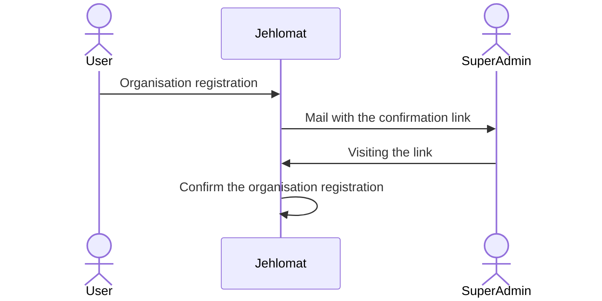
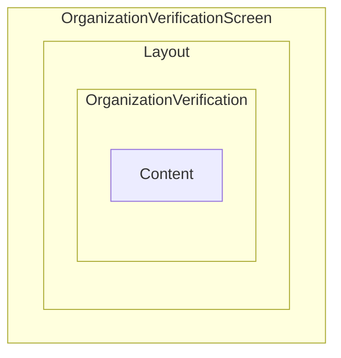
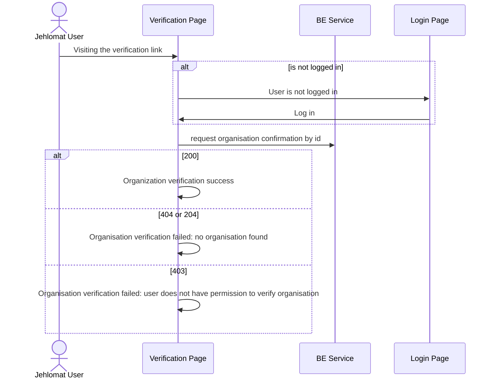

# Organisation Verification

Organisation verification is the last part of the organisation registration flow.

The idea behind it, it to manually confirm organisation registration by the super admin. By manually means that the Super Admin will receive a confirmation link to their email and after visiting it, the organisation registration is confirmed.

## Components hierarchy

The confirmation link redirects a super admin to the organisation verification page.
The component hierarhy looks next:

1. OrganizationVefiricationScreen is the screen components represents the page
2. Layout is the common components to add the header and the footer to the page
3. OrganizationVerification is the business logic component.
4. Content is the view component.

## Business logic

The business logic of the organisation verification consists of the next phases:

1. Checking the user signed in
2. Request verification to the BE service
3. Render the payload to the user on the screen

